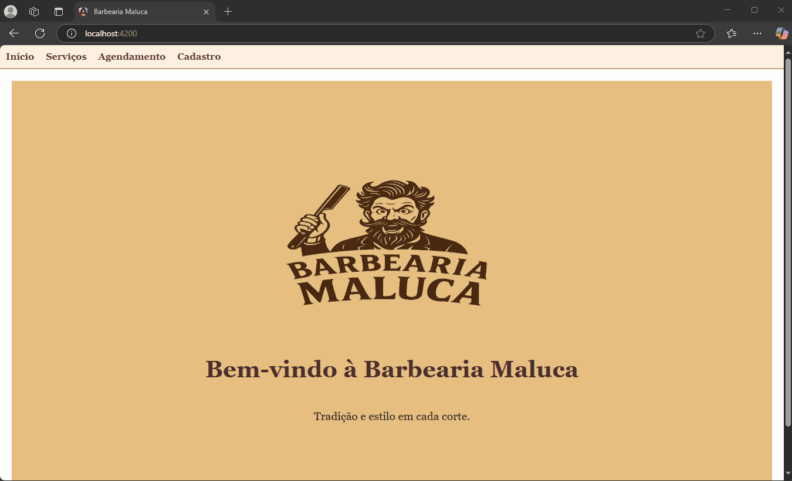
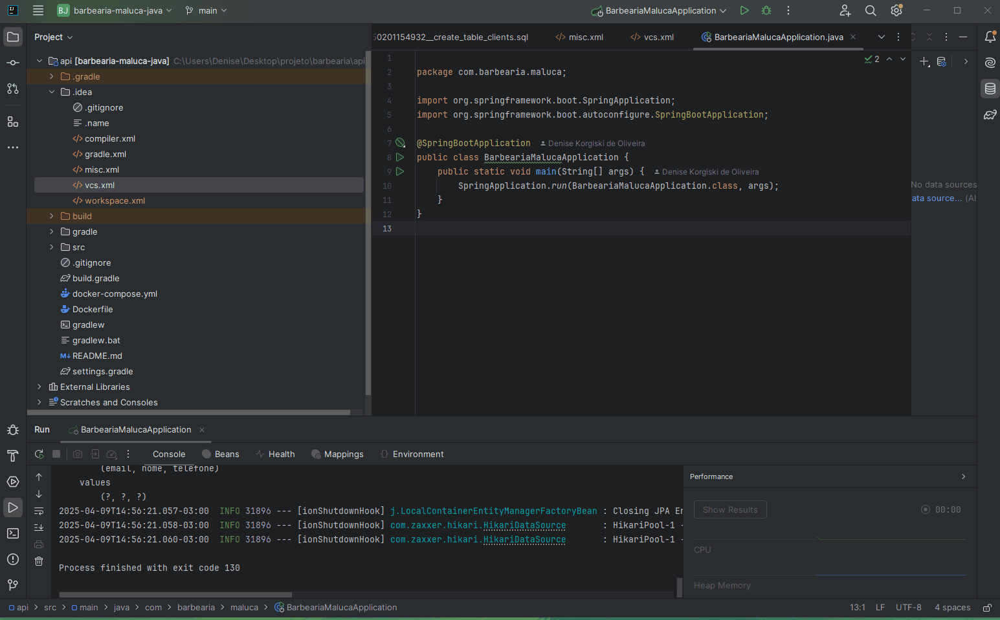

## Criando um APP Full Stack de Agendamento de Barbearia com Java e Angular

## 🎥 Demonstração da Interface



## 🔧 Funcionamento da API




# Diagrama de Classes - Barbearia Maluca

```mermaid
classDiagram
    class Cliente {
        Long id
        String nome
        String telefone
        String email
    }

    class Agendamento {
        Long id
        LocalDateTime dataHora
        String nome
    }

    Cliente <.. Agendamento : relaciona-se

    class ClienteRepository
    class AgendamentoRepository
    ClienteRepository --> Cliente
    AgendamentoRepository --> Agendamento

    class ClienteController
    class AgendamentoController
    ClienteController --> ClienteService
    AgendamentoController --> AgendamentoService
